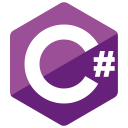

<h1 align="center">
  
  Hi there, I'm JasonScripted
</h1>

<h3 align="center">A Developer from Russia</h3>

-  Currently working on **[PyWinTools](https://github.com/JasonType/PyWinTools/)** and **[JasonType.live](https://github.com/JasonType/JasonType.live/)**
-  Learning new programming languages
-  Developer since 2019
-  Contact: **-/-**

##  About Me

<table>
<tr>
<td valign="top" width="33%">

###  Programming Languages  

</td>

<td valign="top" width="33%">

###  Operating Systems

</td>

<td valign="top" width="33%">

###  Tools

</td>
</tr>
</table>

##  Socials

##  GitHub Stats  

##  Projects  

Check out these projects:

##  Support Me  

